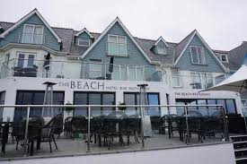

Bude is a small seaside resort town in north Cornwall, England, UK, in the civil parish of Bude-Stratton and at the mouth of the River Neet (also known locally as the River Strat). It is sometimes formerly known as Bude Haven. It lies southwest of Stratton, south of Flexbury and Poughill, and north of Widemouth Bay and is located along the A3073 road off the A39. Bude is twinned with Ergué-Gabéric in Brittany, France. Bude's coast faces Bude Bay in the Celtic Sea, part of the Atlantic Ocean.

```{r}
library(ggmap)
```

```{r}
bude <- geocode("Bude, UK")
beach <- geocode(c("Summerleaze Beach Bude UK","Crooklets Beach Bude UK"))
```
#roadmap
```{r}
budemap <- get_map(bude,zoom=14,maptype="roadmap")
ggmap(budemap)
```
#two beaches
```{r}
ggmap(budemap)+geom_point(
  aes(x=lon,y=lat),data=beach,fill="red",size=3,shape=25,stroke=1)
```
#cricket ground
```{r}
cricket <- geocode("Cricket Club Bude, UK")
ggmap(budemap)+geom_point(
  aes(x=lon,y=lat),data=beach,fill="red",size=3,shape=25,stroke=1)+geom_point(
    aes(x=lon,y=lat),data=cricket,fill="red",size=3,shape=23,stroke=1)
```
#a nearby pub
```{r}
pub <- geocode("Crooklets Inn Bude ,UK")
ggmap(budemap)+geom_point(
  aes(x=lon,y=lat),data=beach,fill="red",size=3,shape=25,stroke=1)+geom_point(
    aes(x=lon,y=lat),data=cricket,fill="red",size=3,shape=23,stroke=1)+geom_point(
      aes(x=lon,y=lat),data=pub,fill="red",size=3,shape=21,stroke=1)
```
#route from cricket ground to the pub
```{r}
from <- "Cricket Club Bude, UK"
to <- "Crooklets Inn Bude, UK"
route <- route(from,to,structure="route")
ggmap(budemap)+geom_point(
  aes(x=lon,y=lat),data=beach,fill="red",size=3,shape=25,stroke=1)+geom_point(
    aes(x=lon,y=lat),data=cricket,fill="red",size=3,shape=23,stroke=1)+geom_point(
      aes(x=lon,y=lat),data=pub,fill="red",size=3,shape=21,stroke=1)+geom_path(
  aes(x = lon, y = lat),  colour = "red", size = 1.5,
  data = route, lineend = "round"
)
```
#Hotels
```{r}
hotel.d <- data.frame(lat=c(50.831393,50.831501),
                    lon=c(-4.548689,-4.549108),
                    hotel=c("Edgcumbe Hotel","The Beach At Bude"))

ggmap(budemap)+geom_point(
  aes(x=lon,y=lat),data=beach,fill="red",size=3,shape=25,stroke=1)+geom_point(
    aes(x=lon,y=lat),data=cricket,fill="red",size=3,shape=23,stroke=1)+geom_point(
      aes(x=lon,y=lat),data=pub,fill="red",size=3,shape=21,stroke=1)+geom_path(
  aes(x = lon, y = lat),  colour = "red", size = 1.5,
  data = route, lineend = "round"
)+ geom_point(dat = hotel.d, aes(x=lon, y=lat, color = hotel),size =3)
```


#watercolor
```{r}
budemap1 <- get_map(bude,zoom=14,maptype="watercolor")
ggmap(budemap1)
```
#two beaches
```{r}
ggmap(budemap1)+geom_point(
  aes(x=lon,y=lat),data=beach,fill="red",size=3,shape=25,stroke=1)
```
#cricket ground
```{r}
cricket <- geocode("Cricket Club Bude UK")
ggmap(budemap1)+geom_point(
  aes(x=lon,y=lat),data=beach,fill="red",size=3,shape=25,stroke=1)+geom_point(
    aes(x=lon,y=lat),data=cricket,fill="red",size=3,shape=23,stroke=1)
```
#a nearby pub
```{r}
pub <- geocode("Crooklets Inn Bude ,UK")
ggmap(budemap1)+geom_point(
  aes(x=lon,y=lat),data=beach,fill="red",size=3,shape=25,stroke=1)+geom_point(
    aes(x=lon,y=lat),data=cricket,fill="red",size=3,shape=23,stroke=1)+geom_point(
      aes(x=lon,y=lat),data=pub,fill="red",size=3,shape=21,stroke=1)
```
#route from cricket ground to the pub
```{r}
from <- "Cricket Club Bude ,UK"
to <- "Crooklets Inn Bude ,UK"
route <- route(from,to,structure="route")
ggmap(budemap1)+geom_point(
  aes(x=lon,y=lat),data=beach,fill="red",size=3,shape=25,stroke=1)+geom_point(
    aes(x=lon,y=lat),data=cricket,fill="red",size=3,shape=23,stroke=1)+geom_point(
      aes(x=lon,y=lat),data=pub,fill="red",size=3,shape=21,stroke=1)+geom_path(
        aes(x = lon, y = lat),  colour = "red", size = 1.5,
        data = route, lineend = "round"
      )
```

```{r}
ggmap(budemap1)+geom_point(
  aes(x=lon,y=lat),data=beach,fill="red",size=3,shape=25,stroke=1)+geom_point(
    aes(x=lon,y=lat),data=cricket,fill="red",size=3,shape=23,stroke=1)+geom_point(
      aes(x=lon,y=lat),data=pub,fill="red",size=3,shape=21,stroke=1)+geom_path(
  aes(x = lon, y = lat),  colour = "red", size = 1.5,
  data = route, lineend = "round"
)
```




